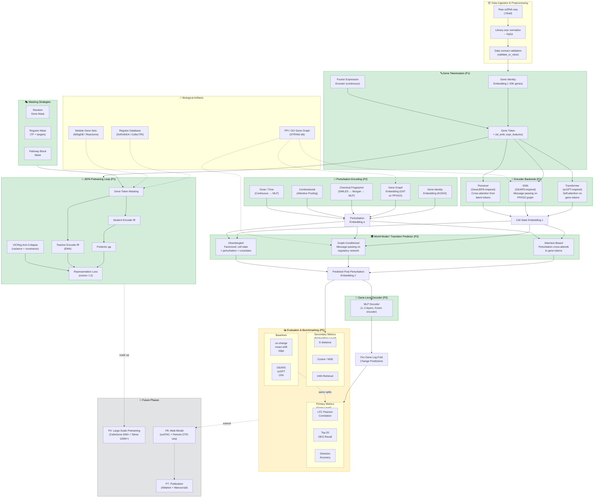

# CellJEPA

CellJEPA investigates **Joint-Embedding Predictive Architectures (JEPAs)** for **single-cell omics**, with the goal of building a competitive perturbation prediction model that outperforms current deep learning methods (GEARS, scGPT, CPA, GeneFormer) on standard benchmarks.

This repo is **benchmark-driven**: the goal is to make a credible, head-to-head case for when JEPA-style learning beats (or loses to) existing approaches.

---

## Why I started this project

Predicting transcriptional responses to perturbations is a core problem in functional genomics and drug discovery. Recent benchmarking work has highlighted a hard reality: deep learning methods have **not yet consistently beaten simple linear baselines** on standard settings. See: *"Deep-learning-based gene perturbation effect prediction does not yet outperform simple linear baselines"* (Nature Methods, 2025): https://www.nature.com/articles/s41592-025-02772-6

CellJEPA is motivated by two hypotheses:
1. **A different training objective** — predicting *latent state* rather than reconstructing noisy observations — may produce better representations for downstream perturbation prediction.
2. **Gene-token architectures** (Transformer / GNN / Perceiver) with **biological priors** (gene interaction graphs, regulon masks) provide the right inductive biases for modeling how perturbations propagate through regulatory networks.

---

## Architecture

### Pipeline overview

### Gene-token encoding
Every cell is tokenized at the gene level:
- **Gene identity embedding:** Learned embedding per gene (~20K human genes)
- **Fourier expression encoding:** Continuous expression → Fourier features (no binning)
- Each expressed gene becomes a token: `(gene_id_embedding, expression_features)`

### Three encoder backends (compared systematically)

| Backend | Inspiration | Key Property |
|---------|-------------|-------------|
| **Transformer** | scGPT | Self-attention captures gene-gene regulatory relationships |
| **GNN** | GEARS | Gene interaction graph provides compositional inductive bias |
| **Perceiver** | GeneJEPA | Fixed compute cost for variable gene counts |

### JEPA training
- Student/teacher (EMA) architecture applied to gene tokens
- Masking at the gene-token level: predict teacher representations of masked genes from visible context
- Masking strategies: random, regulon-aware (TF + targets), pathway-block
- VICReg-style anti-collapse regularization

### Perturbation encoding (biologically grounded)
- **Genetic perturbations:** Gene interaction graph node embeddings (PPI/GO)
- **Drug perturbations:** SMILES → Morgan fingerprints → MLP
- **Dose/time:** Continuous covariates via MLP
- **Combinations:** Attentive pooling over individual perturbation embeddings

### World model / transition prediction
- **Attention-based:** Perturbation cross-attends to gene tokens (interpretable)
- **Graph-conditioned:** Message passing propagates perturbation through regulatory network
- **Disentangled:** Factorized cell state × perturbation × covariates (CPA-inspired)

### Gene-level decoder
- Predicts per-gene log-fold changes from latent post-perturbation embeddings
- Enables gene-level evaluation metrics (not just embedding distances)

---

## Evaluation philosophy

### Primary metrics (gene-level)
- **LFC Pearson correlation**: predicted vs observed log-fold changes
- **Top-20 DEG recall**: correct identification of top differentially expressed genes
- **PerturBench rank metric**: perturbation ranking quality

### Secondary metrics (embedding-level)
- Energy distance, cosine distance, kNN retrieval

### Baselines (mandatory)
- Simple: no-change, mean-shift, ridge regression
- SOTA head-to-head: GEARS, scGPT, CPA (run on identical splits)

### Cross-dataset
- Shared-action only; control z-score calibration by default

---

## Datasets

### Pretraining (no perturbation labels needed)
- CellxGene Census (~50M human cells)
- Tahoe-100M (100M+ cells)

### Perturbation evaluation
- **scPerturb** (harmonized): Sci-Plex 2/3/4 (drug), Norman 2019 (CRISPRa), Replogle 2022 (CRISPRi)
- **Additional:** Dixit 2016, CROP-seq, McFarland 2020, NadigOConner 2024
- **Multi-modal (P6):** Perturb-CITE-seq (RNA + protein), 10x Multiome (RNA + ATAC)

---

## Known risks

- Omics lacks spatial topology → masking policy design is critical (we use regulon-aware masking)
- JEPA can collapse without stability constraints (we use VICReg + collapse diagnostics)
- Perturbation prediction requires distribution-level evaluation (we use per-condition-pair aggregation)
- Strong baselines are hard to beat (we include them mandatory and report honest results)
- DL benchmarking is metric-sensitive (we use both classical and calibrated metrics)

Negative results are treated as informative, as long as they are well-controlled.

---

## Getting started

- Project plan: `docs/plan.md`
- Runbook (contracts + splits + metrics + HPC): `docs/runbook.md`
- Decision log: `docs/DECISIONS.md`
- Project state: `docs/PROJECT_STATE.md`

---

## Repo layout

- `src/celljepa/`   library code (models, losses, data, eval)
- `scripts/`        runnable entry points (train/eval/report)
- `configs/`        experiment, dataset, graph, and regulon configs
- `docs/`           design docs and reports
- `data/`           local data cache (gitignored)
- `runs/`           outputs and checkpoints (gitignored)

---

## References

- I-JEPA: https://arxiv.org/abs/2301.08243
- GeneJEPA: https://www.biorxiv.org/content/10.1101/2025.10.14.682378v1
- sc-JEPA: https://openreview.net/forum?id=MZDkttBUEd
- GEARS: https://www.nature.com/articles/s41587-023-01905-6
- scGPT: https://www.nature.com/articles/s41592-024-02201-0
- GeneFormer: https://www.nature.com/articles/s41586-023-06139-9
- CPA: https://www.embopress.org/doi/full/10.15252/msb.202211517
- scPerturb: https://www.nature.com/articles/s41592-023-02144-y
- Perturb-CITE-seq: https://www.nature.com/articles/s41588-021-00779-1
- Benchmark caution: https://www.nature.com/articles/s41592-025-02772-6
